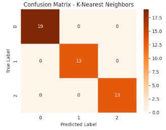

# 🌸 Iris Flower Classification

A simple but complete machine learning project applying classification algorithms to predict Iris flower species — *Setosa*, *Versicolor*, and *Virginica* — based on petal and sepal measurements. The project includes full data exploration, modeling, and evaluation using Scikit-learn.

---

## 🎯 Objective

Build and evaluate classification models using the Iris dataset, focusing on:
- Sepal Length & Width
- Petal Length & Width

---

## 📚 Dataset

- 🔗 Source: [Kaggle - Iris CSV Dataset](https://www.kaggle.com/datasets/saurabh00007/iriscsv)
- 📊 150 samples, 3 balanced classes
- 🧼 No missing values, numeric features, clean and ideal for modeling

---

## 📊 Exploratory Data Analysis (EDA)

- Visualized feature distributions using histograms and pair plots
- Analyzed feature correlation with a heatmap

**Key Insights:**
- Petal dimensions are **highly predictive** and clearly separate the classes.
- Sepal dimensions are less effective, especially sepal width.
- Correlation with species:
  - Petal Length: **0.96**
  - Petal Width: **0.95**
  - Sepal Width: **-0.42**

### 📈 Pairplot

### 🌡️ Correlation Heatmap

---

## 🤖 Models Trained

- Logistic Regression
- K-Nearest Neighbors (KNN)
- Decision Tree Classifier

Used a 70/30 train-test split to evaluate performance.

---

## ✅ Model Evaluation

All models achieved **100% accuracy** on the test set, with zero misclassifications — reflecting how well-separated the classes are in feature space.

### Confusion Matrix - Logistic Regression

### Confusion Matrix - KNN

### Confusion Matrix - Decision Tree

---

## 🧠 What I Learned

- Strong EDA is key to identifying which features actually matter
- Clean and well-separated data enables even simple models to perform perfectly
- Confusion matrices and precision/recall are more informative than accuracy alone

---

## 🔧 Tech Stack

- Python
- Pandas & NumPy
- Seaborn & Matplotlib
- Scikit-learn

---

## 👤 Author

**Manal Bakkhouti**  
Engineering Student • Data Science Enthusiast  
📫 [LinkedIn](https://www.linkedin.com/in/manalbabkhouti)  
💻 [GitHub](https://github.com/manalbakkhouti)

---

## 🏷️ Repo Tags

`machine-learning`, `scikit-learn`, `EDA`, `iris-dataset`, `logistic-regression`, `knn`, `decision-tree`
